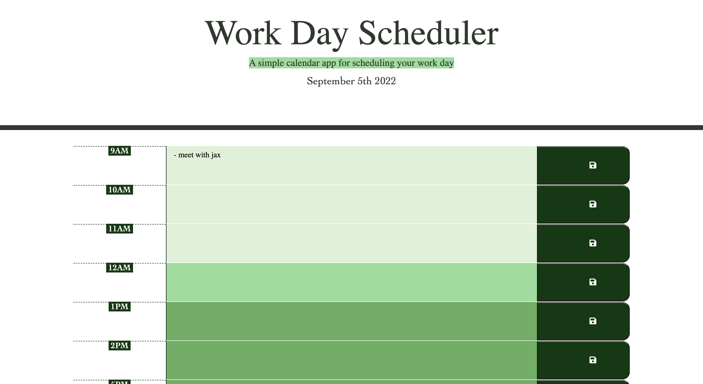
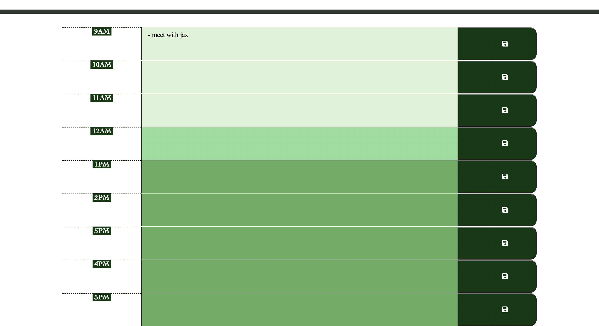

# Challenge5-calendar

## Description

I was given basic HTML and CSS code to create a calender application using jquery and moment APIs. The application should allow a user to save events for each hour of the day using local storage. The application should feature dynamically updated HTML and CSS to allow each time-block to change color to indicate whether it is in the past, present, or future relative to the current hour when the user is on the application.

### Links

#### Screenshot

